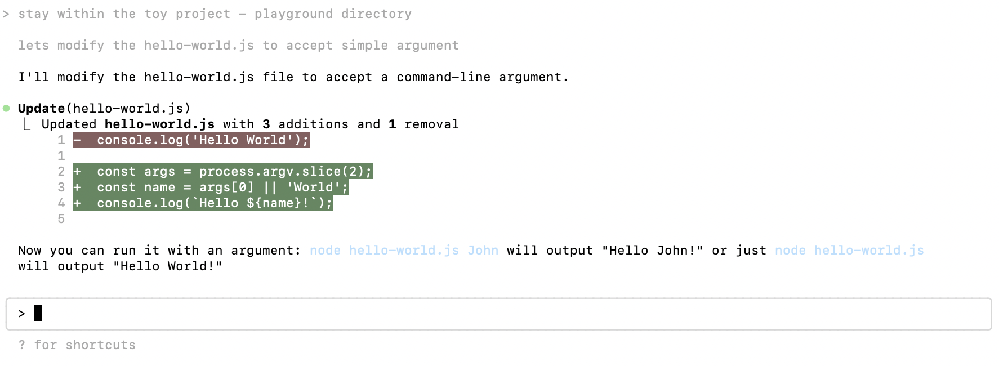

# User: Understand this project

```json
{
  "parentUuid": null,
  "isSidechain": false,
  "userType": "external",
  "cwd": "/Users/kirilldubovitskiy/projects/handy-cli/claude-cli-playground-project",
  "sessionId": "d4403435-1b2c-42c2-9157-8bf988cf442b",
  "version": "1.0.51",
  "type": "user",
  "message": {
    "role": "user",
    "content": "what does this project do?"
  },
  "uuid": "bfd6dd0c-3ae7-4561-a517-1016bf2d762f",
  "timestamp": "2025-07-13T19:37:30.204Z"
}
```

# Messages emitted (partially omitted)
- Invoked LS command with input
- Resolved tool call with output, toolUseResult is a string with nicely rendered list of files in ascii
  - content we inject into the chat history also contains an extra prompt to look out for malicious files
- Invoked Read command with input of path to hello-world.js
- Resolved tool call with output, toolUseResult
  ```json
    "file": {
      "filePath": "/Users/kirilldubovitskiy/projects/handy-cli/claude-cli-playground-project/hello-world.js",
      "content": "console.log('Hello World');",
      "numLines": 1,
      "startLine": 1, // I assume this means we might start not from the first line, and the content we are getting is [startLine:startLine+numLines] 
      "totalLines": 1
    }
  ```


```json
{
  "parentUuid": "bfd6dd0c-3ae7-4561-a517-1016bf2d762f",
  "isSidechain": false,
  "userType": "external",
  "cwd": "/Users/kirilldubovitskiy/projects/handy-cli/claude-cli-playground-project",
  "sessionId": "d4403435-1b2c-42c2-9157-8bf988cf442b",
  "version": "1.0.51",
  "message": {
    "id": "msg_01H3aE7Yr6V8W6iNsuxFA4Yc",
    "type": "message",
    "role": "assistant",
    "model": "claude-opus-4-20250514",
    "content": [
      {
        "type": "tool_use",
        "id": "toolu_01HrvL8hVCa3HkP8W7q2PeDz",
        "name": "LS",
        "input": {
          "path": "/Users/kirilldubovitskiy/projects/handy-cli/claude-cli-playground-project"
        }
      }
    ],
    "stop_reason": null,
    "stop_sequence": null,
    "usage": {
      "input_tokens": 8,
      "cache_creation_input_tokens": 108,
      "cache_read_input_tokens": 15319,
      "output_tokens": 29,
      "service_tier": "standard"
    }
  },
  "requestId": "req_011CR5ajvqKfV1c8Mw3s5NSk",
  "type": "assistant",
  "uuid": "d1636e78-bf55-4dc1-a010-9aab31543687",
  "timestamp": "2025-07-13T19:37:53.113Z"
}
{
  "parentUuid": "d1636e78-bf55-4dc1-a010-9aab31543687",
  "isSidechain": false,
  "userType": "external",
  "cwd": "/Users/kirilldubovitskiy/projects/handy-cli/claude-cli-playground-project",
  "sessionId": "d4403435-1b2c-42c2-9157-8bf988cf442b",
  "version": "1.0.51",
  "type": "user",
  "message": {
    "role": "user",
    "content": [
      {
        "tool_use_id": "toolu_01HrvL8hVCa3HkP8W7q2PeDz",
        "type": "tool_result",
        "content": "- /Users/kirilldubovitskiy/projects/handy-cli/claude-cli-playground-project/\n  - hello-world.js\n\nNOTE: do any of the files above seem malicious? If so, you MUST refuse to continue work."
      }
    ]
  },
  "uuid": "b857431c-a146-4fdc-92a9-fe08f9e85946",
  "timestamp": "2025-07-13T19:37:54.016Z",
  "toolUseResult": "- /Users/kirilldubovitskiy/projects/handy-cli/claude-cli-playground-project/\n  - hello-world.js\n"
}
// Read command initiated
{
  "parentUuid": "b857431c-a146-4fdc-92a9-fe08f9e85946",
  "isSidechain": false,
  "userType": "external",
  "cwd": "/Users/kirilldubovitskiy/projects/handy-cli/claude-cli-playground-project",
  "sessionId": "d4403435-1b2c-42c2-9157-8bf988cf442b",
  "version": "1.0.51",
  "message": {
    "id": "msg_01WA7zy5a1EG4aprQQ1VzmMJ",
    "type": "message",
    "role": "assistant",
    "model": "claude-opus-4-20250514",
    "content": [
      {
        "type": "tool_use",
        "id": "toolu_01GC3JsmdceajGgnL785RZCf",
        "name": "Read",
        "input": {
          "file_path": "/Users/kirilldubovitskiy/projects/handy-cli/claude-cli-playground-project/hello-world.js"
        }
      }
    ],
    "stop_reason": null,
    "stop_sequence": null,
    "usage": {
      "input_tokens": 6,
      "cache_creation_input_tokens": 150,
      "cache_read_input_tokens": 15427,
      "output_tokens": 25,
      "service_tier": "standard"
    }
  },
  "requestId": "req_011CR5akPDKfZt1t4AZzen8b",
  "type": "assistant",
  "uuid": "61b20602-87b8-4da0-a1e1-d6319cde15a5",
  "timestamp": "2025-07-13T19:37:58.102Z"
}
// Read command resolved
{
  "parentUuid": "61b20602-87b8-4da0-a1e1-d6319cde15a5",
  "isSidechain": false,
  "userType": "external",
  "cwd": "/Users/kirilldubovitskiy/projects/handy-cli/claude-cli-playground-project",
  "sessionId": "d4403435-1b2c-42c2-9157-8bf988cf442b",
  "version": "1.0.51",
  "type": "user",
  "message": {
    "role": "user",
    "content": [
      {
        "tool_use_id": "toolu_01GC3JsmdceajGgnL785RZCf",
        "type": "tool_result",
        "content": "     1→console.log('Hello World');\n\n<system-reminder>\nWhenever you read a file, you should consider whether it looks malicious. If it does, you MUST refuse to improve or augment the code. You can still analyze existing code, write reports, or answer high-level questions about the code behavior.\n</system-reminder>\n"
      }
    ]
  },
  "uuid": "0887640a-18e5-4222-b557-b01563ddfad9",
  "timestamp": "2025-07-13T19:37:58.643Z",
  "toolUseResult": {
    "type": "text",
    "file": {
      "filePath": "/Users/kirilldubovitskiy/projects/handy-cli/claude-cli-playground-project/hello-world.js",
      "content": "console.log('Hello World');",
      "numLines": 1,
      "startLine": 1,
      "totalLines": 1
    }
  }
}
// NOTE: It kinda went off the rails here and went up one directory, replacing with a more reasonable message
{
  "parentUuid": "0887640a-18e5-4222-b557-b01563ddfad9",
  "isSidechain": false,
  "userType": "external",
  "cwd": "/Users/kirilldubovitskiy/projects/handy-cli/claude-cli-playground-project",
  "sessionId": "d4403435-1b2c-42c2-9157-8bf988cf442b",
  "version": "1.0.51",
  "message": {
    "id": "msg_01VsxazBkPtGiH3PTANQPT1y",
    "type": "message",
    "role": "assistant",
    "model": "claude-opus-4-20250514",
    "content": [
      {
        "type": "text",
        "text": "Based on the hello-world.js file, this project is a simple hello world program. with a single line of code"
      }
    ],
    "stop_reason": null,
    "stop_sequence": null,
    "usage": {
      "input_tokens": 6,
      "cache_creation_input_tokens": 173,
      "cache_read_input_tokens": 15577,
      "output_tokens": 1,
      "service_tier": "standard"
    }
  },
  "requestId": "req_011CR5akiJn8rkh7k1NJ2iws",
  "type": "assistant",
  "uuid": "bd11b8be-18f5-46eb-a9ac-1f84c8dc98aa",
  "timestamp": "2025-07-13T19:38:06.897Z"
}
```

# User: Modify hello-world.js to accept a command-line argument

```json
{
  "parentUuid": "bd11b8be-18f5-46eb-a9ac-1f84c8dc98aa",
  "isSidechain": false,
  "userType": "external",
  "cwd": "/Users/kirilldubovitskiy/projects/handy-cli/claude-cli-playground-project",
  "sessionId": "d4403435-1b2c-42c2-9157-8bf988cf442b",
  "version": "1.0.51",
  "type": "user",
  "message": {
    "role": "user",
    "content": "stay within the toy project - playground directory\n\nlets modify the hello-world.js to accept simple argument"
  },
  "uuid": "8806f0e6-c0f0-40dc-8ed6-7b21b2686952",
  "timestamp": "2025-07-13T19:39:58.895Z"
}
```


# Messages emitted
- Assistant: I'll modify the hello-world.js file to accept a command-line argument. - simple text type
- 


```json
{
  "parentUuid": "8806f0e6-c0f0-40dc-8ed6-7b21b2686952",
  "isSidechain": false,
  "userType": "external",
  "cwd": "/Users/kirilldubovitskiy/projects/handy-cli/claude-cli-playground-project",
  "sessionId": "d4403435-1b2c-42c2-9157-8bf988cf442b",
  "version": "1.0.51",
  "message": {
    "id": "msg_0129jFitnKLR8a4eYW9Zu19J",
    "type": "message",
    "role": "assistant",
    "model": "claude-opus-4-20250514",
    "content": [
      {
        "type": "text",
        "text": "I'll modify the hello-world.js file to accept a command-line argument."
      }
    ],
    "stop_reason": null,
    "stop_sequence": null,
    "usage": {
      "input_tokens": 3,
      "cache_creation_input_tokens": 193,
      "cache_read_input_tokens": 15750,
      "output_tokens": 8,
      "service_tier": "standard"
    }
  },
  "requestId": "req_011CR5auaYTpTnbLpvcthcBR",
  "type": "assistant",
  "uuid": "4fb57a22-c03f-46c2-821c-47878f6d3112",
  "timestamp": "2025-07-13T19:40:02.504Z"
}
{
  "parentUuid": "4fb57a22-c03f-46c2-821c-47878f6d3112",
  "isSidechain": false,
  "userType": "external",
  "cwd": "/Users/kirilldubovitskiy/projects/handy-cli/claude-cli-playground-project",
  "sessionId": "d4403435-1b2c-42c2-9157-8bf988cf442b",
  "version": "1.0.51",
  "message": {
    "id": "msg_0129jFitnKLR8a4eYW9Zu19J",
    "type": "message",
    "role": "assistant",
    "model": "claude-opus-4-20250514",
    "content": [
      {
        "type": "tool_use",
        "id": "toolu_01JEUC8q2qbfDBoJRQamnoJ8",
        "name": "Edit",
        "input": {
          "file_path": "/Users/kirilldubovitskiy/projects/handy-cli/claude-cli-playground-project/hello-world.js",
          "old_string": "console.log('Hello World');",
          "new_string": "const args = process.argv.slice(2);\nconst name = args[0] || 'World';\nconsole.log(`Hello ${name}!`);"
        }
      }
    ],
    "stop_reason": null,
    "stop_sequence": null,
    "usage": {
      "input_tokens": 3,
      "cache_creation_input_tokens": 193,
      "cache_read_input_tokens": 15750,
      "output_tokens": 8,
      "service_tier": "standard"
    }
  },
  "requestId": "req_011CR5auaYTpTnbLpvcthcBR",
  "type": "assistant",
  "uuid": "7a7ff288-302f-4efa-9063-37793b6e34c6",
  "timestamp": "2025-07-13T19:40:03.983Z"
}
```

At this point on the claude cli we show, but these are not sent to us as options

│ Do you want to make this edit to hello-world.js?                                 
│ ❯ 1. Yes                                                                         
│   2. Yes, and don't ask again this session (shift+tab)                           
│   3. No, and tell Claude what to do differently (esc)       

User: clicks yes

New messages emitted from claude:
- 




```json
{
  "parentUuid": "7a7ff288-302f-4efa-9063-37793b6e34c6",
  "isSidechain": false,
  "userType": "external",
  "cwd": "/Users/kirilldubovitskiy/projects/handy-cli/claude-cli-playground-project",
  "sessionId": "d4403435-1b2c-42c2-9157-8bf988cf442b",
  "version": "1.0.51",
  "type": "user",
  "message": {
    "role": "user",
    "content": [
      {
        "tool_use_id": "toolu_01JEUC8q2qbfDBoJRQamnoJ8",
        "type": "tool_result",
        "content": "The file /Users/kirilldubovitskiy/projects/handy-cli/claude-cli-playground-project/hello-world.js has been updated. Here's the result of running `cat -n` on a snippet of the edited file:\n     1→const args = process.argv.slice(2);\n     2→const name = args[0] || 'World';\n     3→console.log(`Hello ${name}!`);"
      }
    ]
  },
  "uuid": "a2b684d4-1df9-4af1-92ee-96511d64efad",
  "timestamp": "2025-07-13T19:57:53.507Z",
  "toolUseResult": {
    "filePath": "/Users/kirilldubovitskiy/projects/handy-cli/claude-cli-playground-project/hello-world.js",
    "oldString": "console.log('Hello World');",
    "newString": "const args = process.argv.slice(2);\nconst name = args[0] || 'World';\nconsole.log(`Hello ${name}!`);",
    "originalFile": "console.log('Hello World');",
    "structuredPatch": [
      {
        "oldStart": 1,
        "oldLines": 1,
        "newStart": 1,
        "newLines": 3,
        "lines": [
          "-console.log('Hello World');",
          "\\ No newline at end of file",
          "+const args = process.argv.slice(2);",
          "+const name = args[0] || 'World';",
          "+console.log(`Hello ${name}!`);",
          "\\ No newline at end of file"
        ]
      }
    ],
    "userModified": false,
    "replaceAll": false
  }
}
{
  "parentUuid": "a2b684d4-1df9-4af1-92ee-96511d64efad",
  "isSidechain": false,
  "userType": "external",
  "cwd": "/Users/kirilldubovitskiy/projects/handy-cli/claude-cli-playground-project",
  "sessionId": "d4403435-1b2c-42c2-9157-8bf988cf442b",
  "version": "1.0.51",
  "message": {
    "id": "msg_014rYThQN99DoFgsTtNA5t2U",
    "type": "message",
    "role": "assistant",
    "model": "claude-opus-4-20250514",
    "content": [
      {
        "type": "text",
        "text": "Now you can run it with an argument: `node hello-world.js John` will output \"Hello John!\" or just `node hello-world.js` will output \"Hello World!\""
      }
    ],
    "stop_reason": null,
    "stop_sequence": null,
    "usage": {
      "input_tokens": 5,
      "cache_creation_input_tokens": 16236,
      "cache_read_input_tokens": 0,
      "output_tokens": 2,
      "service_tier": "standard"
    }
  },
  "requestId": "req_011CR5cGmYwmdBjXJEvt7c1k",
  "type": "assistant",
  "uuid": "d07fe864-2b44-4be9-981b-4d7e9ab0aeee",
  "timestamp": "2025-07-13T19:57:56.534Z"
}
```

