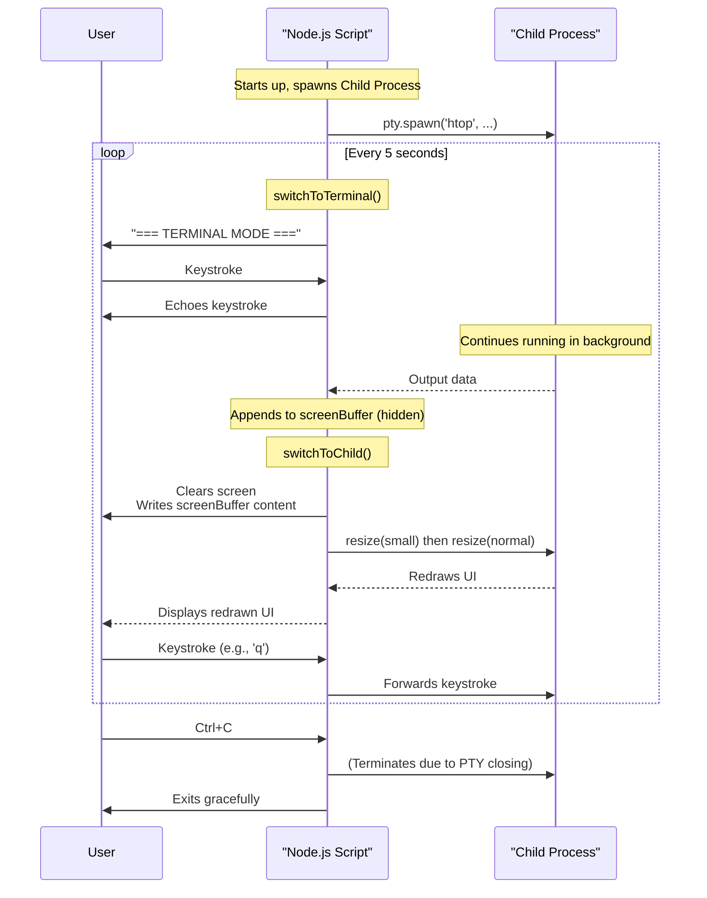

```javascript
// Auto-switching PTY experiment with screen buffer + resize trick
// Maintains full screen state and mouse functionality

const pty = require('node-pty');

// Get command from args or default to htop
const command = process.argv[2] || 'htop';
const args = process.argv.slice(3);

// Create PTY process
const childProcess = pty.spawn(command, args, {
  name: 'xterm-256color',
  cols: process.stdout.columns,
  rows: process.stdout.rows,
  cwd: process.cwd(),
  env: process.env
});

let showingChild = true;
let screenBuffer = '';

// Set up raw mode
process.stdin.setRawMode(true);
process.stdin.resume();

// Handle input
process.stdin.on('data', (data) => {
  // Ctrl+C to exit
  if (data.toString() === '\u0003') {
    cleanup();
    process.exit();
  }
  
  if (showingChild) {
    childProcess.write(data);
  } else {
    // In terminal mode, just echo the input
    process.stdout.write(data);
  }
});

// Handle child output
childProcess.onData((data) => {
  // Always accumulate in buffer
  screenBuffer += data;
  
  // Only display if currently showing child
  if (showingChild) {
    process.stdout.write(data);
  }
  
  // Keep buffer size reasonable (last ~100KB)
  if (screenBuffer.length > 100000) {
    screenBuffer = screenBuffer.slice(-50000);
  }
});

// Handle resize
process.on('SIGWINCH', () => {
  childProcess.resize(process.stdout.columns, process.stdout.rows);
});

// Clean exit
childProcess.onExit(() => {
  console.log(`\n${command} exited`);
  cleanup();
  process.exit();
});

function cleanup() {
  process.stdin.setRawMode(false);
  clearInterval(switchInterval);
}

function findLastCompleteScreen(buffer) {
  // Look for the last clear screen sequence
  const clearScreen = '\x1b[2J';
  let lastClearIndex = buffer.lastIndexOf(clearScreen);
  
  if (lastClearIndex === -1) {
    // No clear screen found, return entire buffer
    return buffer;
  }
  
  // Return everything from the last clear screen onward
  return buffer.slice(lastClearIndex);
}

function switchToChild() {
  showingChild = true;
  
  // Clear current screen
  process.stdout.write('\x1b[2J\x1b[H');
  
  // First replay the buffered screen content
  const lastScreen = findLastCompleteScreen(screenBuffer);
  if (lastScreen) {
    process.stdout.write(lastScreen);
  }
  
  // Then force a resize to trigger proper redraw and mouse state sync
  const cols = process.stdout.columns;
  const rows = process.stdout.rows;
  
  // Resize to smaller then back to original
  childProcess.resize(cols - 1, rows - 1);
  setTimeout(() => {
    childProcess.resize(cols, rows);
  }, 10);
  
  console.log(`\n=== ${command.toUpperCase()} SESSION (5 seconds) ===`);
}

function switchToTerminal() {
  showingChild = false;
  
  // Clear and reset screen
  process.stdout.write('\x1b[2J\x1b[H');
  
  console.log('=== TERMINAL MODE (5 seconds) ===');
  console.log('Type anything, it will echo here.');
  console.log(`${command} is still running in background!\n`);
  console.log('> ');
}

// Initial state
console.log(`Starting auto-switch demo with ${command} (Ctrl+C to exit)`);
console.log('Will switch between child process and terminal every 5 seconds\n');

// Start with terminal mode first
setTimeout(() => {
  switchToTerminal();
}, 1000);

// Auto-switch every 5 seconds
const switchInterval = setInterval(() => {
  if (showingChild) {
    switchToTerminal();
  } else {
    switchToChild();
  }
}, 5000);

```

Here’s a breakdown of how it works, from the core concepts to the clever tricks it uses.

### The Core Idea: Process Multiplexing

The script's main goal is to run a full-screen terminal application in the background while allowing you to temporarily switch back to your main terminal to type commands, and then switch back to the application without losing its state. It's like a very simple version of a terminal multiplexer like `tmux` or `screen`.

### The Pseudo-Terminal (`node-pty`)

The magic starts with `node-pty`. A pseudo-terminal is a pair of virtual devices that provide a communication channel, which another program can use to interact with the application.

*   The script spawns the child process (`htop` by default) inside this PTY.
*   To the child process, it looks like it's running in a normal terminal. It can receive input, send output, and even respond to window size changes.
*   To our Node.js script, the PTY is an object that lets us programmatically send data to the child process (as if we were typing) and read all of its output.


### The Screen Buffer: Remembering the UI

When the child application is running but not being shown (`showingChild` is `false`), where does its output go? It goes into the `screenBuffer`.

*   `childProcess.onData((data) => { ... })`: This event listener captures *all* output from the child process at all times.
*   `screenBuffer += data;`: The output is continuously appended to this string variable.
*   This buffer is the key to restoring the application's state. When you switch back to the application, the script replays the last complete "screen" from this buffer so it looks like you never left.


NOTE: Use markdown preview + mermaid extension to see the diagram.
